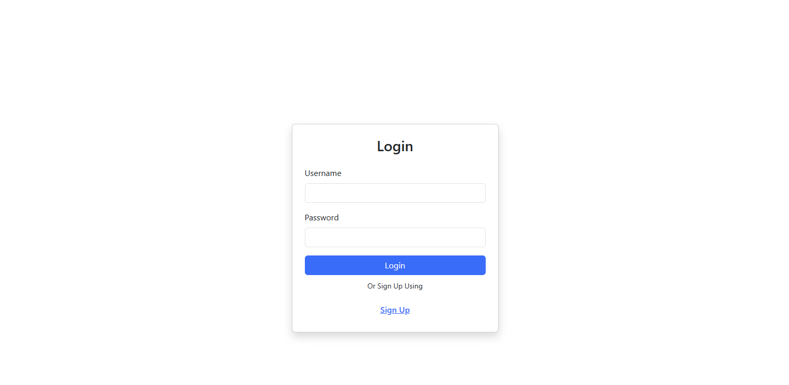
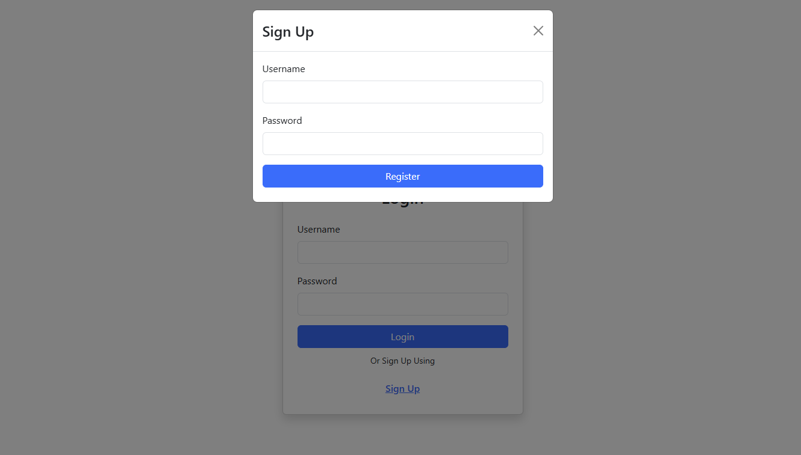
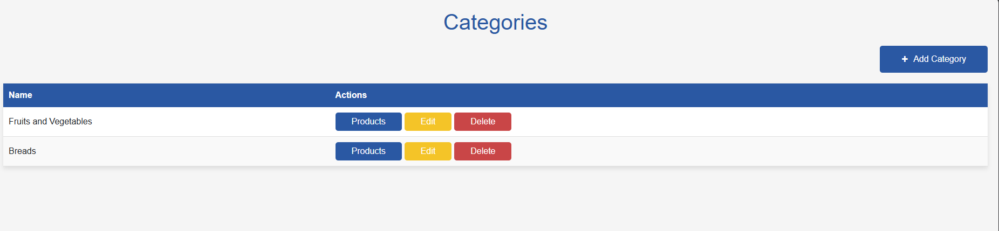
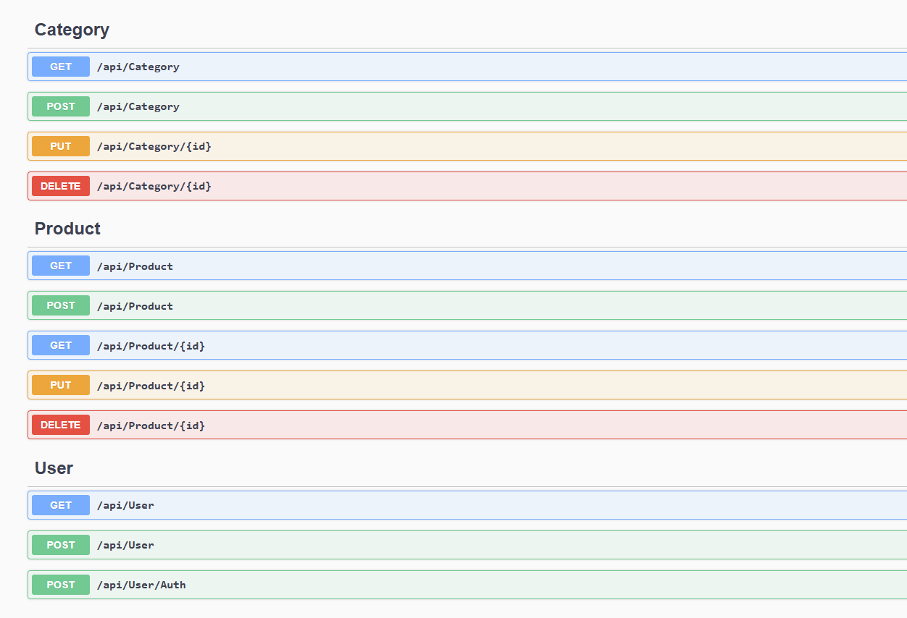

# ProductsApp

## Descrição

O **ProductsApp** é uma aplicação desenvolvida para gerenciar produtos de forma eficiente. O backend foi construído utilizando **.NET 8**, garantindo alta performance e escalabilidade.

## Tecnologias Utilizadas

- **Backend**: .NET 8
- **Frontend**: [Especifique aqui se houver]
- **Banco de Dados**: [Especifique aqui se houver]

## Funcionalidades

- Cadastro de produtos
- Atualização de informações de produtos
- Exclusão de produtos
- Listagem de produtos

## Imagens da Aplicação





## Como Executar

1. Clone o repositório:
   ```bash
   git clone https://github.com/SamuelFLM/extension-course-api-ufc.git
   ```
2. Navegue até a pasta do projeto:
   ```bash
   cd ProductsApp
   ```
3. Configure o ambiente e execute o backend:
   ```bash
   dotnet run
   ```
4. Configure o ambiente e execute o frontend:
   ```bash
   cd frontend
   npm install
   npm start
   ```

## Contribuição

Contribuições são bem-vindas! Sinta-se à vontade para abrir issues e enviar pull requests.
